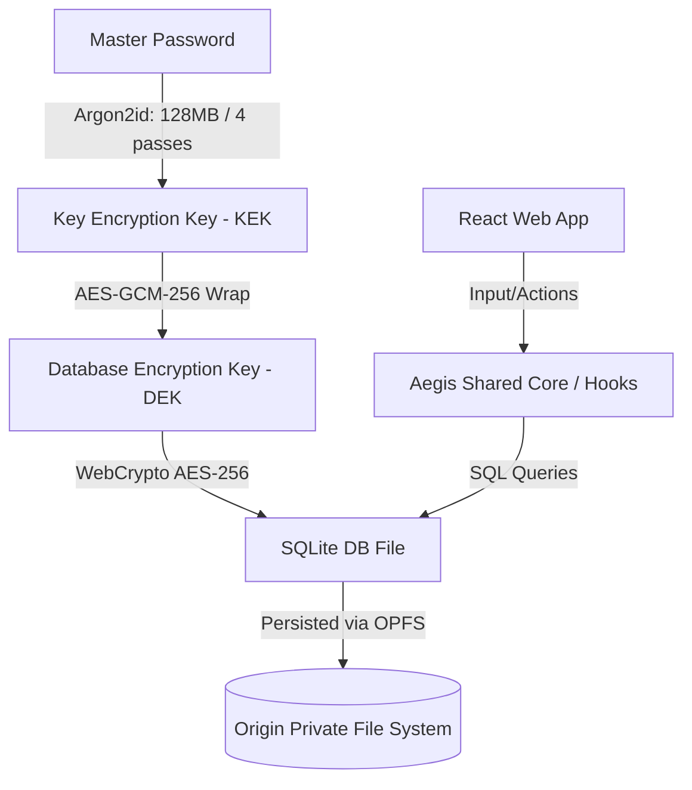

# 🛡️ Aegis Vault 7

Aegis Vault 7 is a state-of-the-art, **local-first, privacy-respecting credentials manager and secure vault**. Designed with a security-first philosophy, it stores passwords, payment cards, passkeys, identities, and secure notes entirely on your local machine with zero external cloud dependencies.

This repository serves as the shared core and web foundation, packaged for the desktop using **Tauri**, and architected to share its cryptographic core with a future Android application.

---

## ✨ Key Features

*   **🔒 Local-First Storage:** Powered by SQLite inside the **Origin Private File System (OPFS)**. Your data stays entirely sandboxed in your browser or local desktop container.
*   **🛡️ Hardened Cryptography:** Dual-layer **AES-GCM 256-bit encryption** using the native WebCrypto API.
*   **⚙️ Advanced Key Derivation:** Custom **Argon2id KDF** module configured with premium parameters: `128 MiB memory` and `4 iterations (passes)` for maximum resistance against brute-force and side-channel attacks.
*   **🔄 Seamless Auto-Migration:** Automated key derivation upgrade mechanism that transparently re-encrypts legacy databases to the latest cryptographic standard upon successful master password entry.
*   **🏷️ Categorized Organization:** Real-time filtered dashboard offering custom categorization for:
    *   **Giriş Bilgileri (Logins)**
    *   **Ödeme Kartları (Cards)**
    *   **Passkey / API Anahtarları**
    *   **Kimlik Belgeleri (Identities)**
    *   **Güvenli Notlar (Secure Notes)**
*   **⏱️ Integrated Authenticator (TOTP):** Stable 2FA code generation aligned with RFC 6238 time steps.
*   **📊 Security Auditing:** Built-in Aegis Guard engine that evaluates password strength, detects reused credentials, and generates a visual Virtual Protection Score.
*   **🗑️ Retention-Based Trash:** Recover deleted items safely before they are permanently purged.

---

## 🏗️ Architecture & Cryptography Flow

The diagram below outlines the secure data flow inside Aegis Vault 7, from master key derivation to encrypted SQLite disk storage.



---

## 📂 Project Directory Structure

Aegis Vault 7 maintains a modular and strict structure separating frontend components, business hooks, database abstraction, and cryptographic services:

```text
├── .github/workflows/      # CI/CD pipelines (Windows Desktop builds)
├── src/
│   ├── components/         # Reusable UI components (React + TSX)
│   │   ├── VaultWorkspace  # Main password list panel & category chips
│   │   ├── MainContent     # Central workspace router
│   │   ├── SettingsPanel   # Lock settings, DB management & KDF specs
│   │   └── ...
│   ├── hooks/              # Custom React state hooks (Business logic)
│   │   ├── useVaultQueries # Handles searching, sorting, and auditing
│   │   ├── useVaultFilters # Manages query filters & category selection
│   │   └── ...
│   ├── i18n/               # Internationalization engine
│   │   └── translations.ts # English, Turkish, and Chinese translations
│   ├── lib/                # Core libraries & logic
│   │   ├── sqlite_opfs.ts  # SQLite integration with OPFS & Migration rules
│   │   ├── encryption.ts   # Core encryption & file import/export envelope
│   │   ├── argon2id.ts     # Argon2id wrapper & default params
│   │   ├── webcrypto.ts    # WebCrypto AES-GCM abstraction
│   │   └── security.ts     # Password audit algorithm (Aegis Guard)
│   ├── types.ts            # Shared TypeScript definitions
│   ├── App.tsx             # Application shell & orchestration layer
│   └── main.tsx            # Application entry point
├── src-tauri/              # Tauri configuration & Rust bindings for desktop
├── vite.config.ts          # Vite configuration
└── package.json            # NPM dependencies and script commands
```

---

## 🚀 Getting Started

### Prerequisites
*   **Node.js:** v22 or newer
*   **Rust (optional for Desktop development):** Stable toolchain

### Installation & Run

1.  **Clone the repository:**
    ```bash
    git clone https://github.com/hafgit99/aegis-vault-v7.git
    cd aegis-vault-v7
    ```

2.  **Install dependencies:**
    ```bash
    npm install
    ```

3.  **Run the local development server:**
    ```bash
    npm run dev
    ```
    The server will start on `http://localhost:3000`.

---

## 📊 Security Comparison & Standards

To objectively evaluate the security profile of Aegis Vault 7, the table below compares its core architectural choices against industry-standard password manager profiles:

| Security Feature | Aegis Vault 7 | Typical Cloud-Based Manager | Traditional Offline Manager |
|:---|:---:|:---:|:---:|
| **Storage Architecture** | **Local-First (OPFS & Sandboxed DB)** | Centralized Cloud Database | Local Filesystem Binary |
| **Key Derivation Function (KDF)** | **Argon2id (Hardened: 128MB / 4 passes)** | PBKDF2 / Light Argon2id | AES-KDF / Argon2d |
| **Symmetric Encryption** | **AES-256-GCM (Authenticated AEAD)** | AES-CBC (Lack of Integrity Check) | AES-256 / ChaCha20 |
| **Plaintext Password in RAM** | **Zeroized** (`Uint8Array.fill(0)` on Lock) | Variable (GC/Immutable Strings) | Variable |
| **Symmetric Key Cache Protection** | **SHA-256 Hashed Cache Keys** | Raw Key Hex String Caching | Raw Key Caching |
| **IV / Nonce Generation** | **NIST SP 800-38D Counter-Based** | Random (Birthday Collision Risks) | Random or Static |
| **Network Attack Surface** | **Application-Level Air-Gap Policy** | Permanent Remote Sync Syncing | Native File (System Dependent) |
| **Biometric Metadata Isolation** | **Sandboxed IndexedDB Storage** | Plain LocalStorage / Browser Cache | Plugin / System Dependent |
| **Downgrade Attack Prevention** | **Enforced Minimum KDF Thresholds** | Client-Dependent | Client-Dependent |

---

## 🧪 Quality and Testing

Aegis Vault 7 enforces clean code and verification through automated unit testing (Vitest) and typechecking.

### Code Coverage


| Metric | Coverage |
| :--- | :---: |
| **Statements** | `95.73%` |
| **Branches** | `88.73%` |
| **Functions** | `92.06%` |
| **Lines** | `95.73%` |

*   **Run all unit tests:**
    ```bash
    npm run test:unit
    ```
*   **Run TypeScript compiler validation:**
    ```bash
    npm run typecheck
    ```
*   **Compile production build bundle:**
    ```bash
    npm run build
    ```

---

## 🛡️ Security & Disclosure

This application stores sensitive credentials locally. For production deployment, ensure the environment runs over **HTTPS** (or inside local Tauri sandboxing) to satisfy the WebCrypto API requirements.
