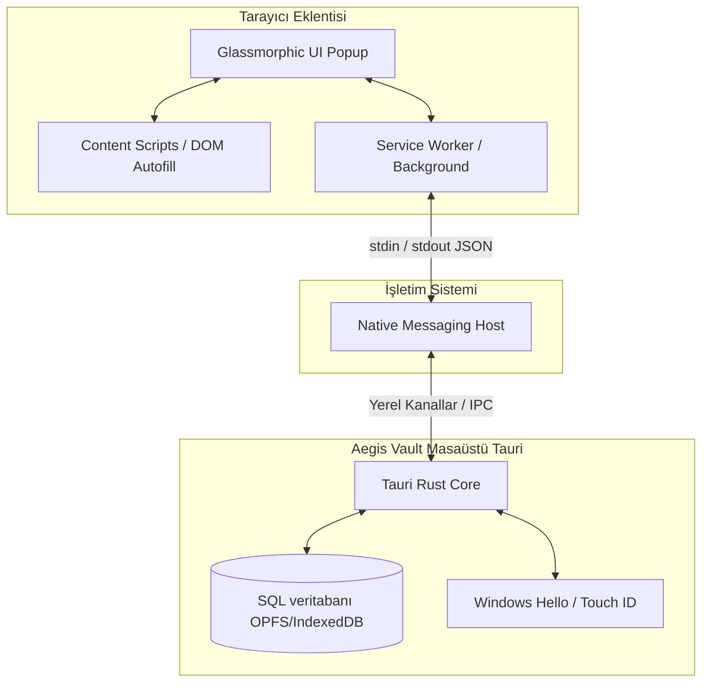
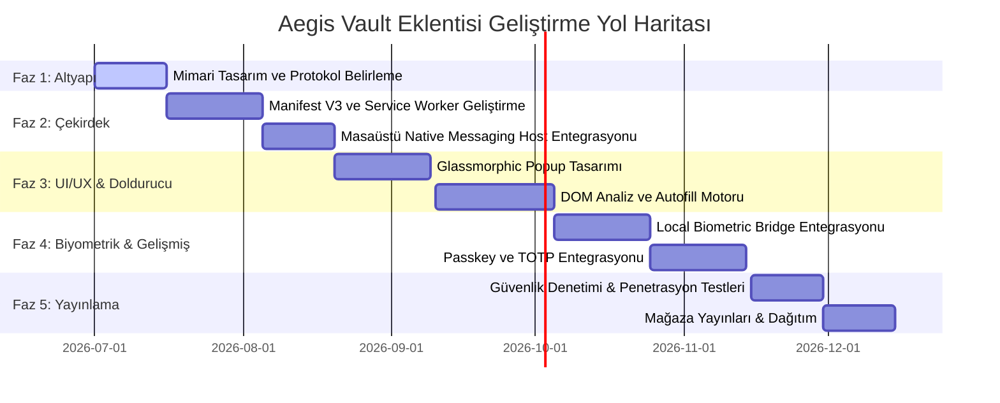

# 🧭 Aegis Vault v7 — Tarayıcı Eklentisi Yol Haritası & Tasarım Raporu
*Chrome, Firefox ve Edge için Çevrimdışı (Offline-First) Mimari ve Premium Özellikler*

## 1. Giriş ve Stratejik Vizyon
Aegis Vault v7, sıfır-bulut bağımlılığı ve yerel-ilk (local-first) prensipleriyle çalışan, yüksek güvenlikli ve performanslı bir şifre yöneticisidir. Masaüstü uygulamasının sunduğu bu güçlü çevrimdışı mimariyi, kullanıcıların günlük internet deneyimiyle buluşturacak bir **tarayıcı eklentisi (Browser Extension)** tasarlanması hedeflenmektedir.

Bu yol haritası, eklentinin hem güvenlik hem de kullanıcı deneyimi (UX) açısından **1Password**, **Bitwarden** ve **KeePassXC** gibi devleri geride bırakacak yenilikçi yönlerini ve adım adım teknik yol haritasını içerir.

### Neden 1Password ve Diğerlerinden Daha İleri?
1. **Tam Çevrimdışı Güvenlik:** 1Password ve Bitwarden, verileri bulutta eşzamanlar. Aegis Vault ise verilerinizi yalnızca sizin kontrolünüzdeki cihazlarda tutar. Eklenti, tarayıcınızın dış dünyaya bağlanmasına gerek kalmadan, doğrudan yerel masaüstü uygulaması ile kriptografik olarak güvenli bir şekilde konuşur.
2. **Native Messaging Entegrasyonu:** WebSocket kullanan rakiplerin aksine (KeePassXC gibi), yerel işletim sistemi yetkilendirmesiyle (Native Messaging) doğrudan Tauri Rust katmanına bağlanarak port açma riskini ve ağ dinleme saldırılarını tamamen engeller.
3. **Modern Cam Efektli (Glassmorphism) Estetik:** Rakiplerin sıkıcı ve eski arayüzleri yerine, modern tarayıcıların tasarım dilleriyle tam uyumlu, akıcı mikro animasyonlara sahip ve göz yormayan premium bir arayüz sunar.

---

## 2. Mimari Kararlar: Masaüstü Uygulaması ile İletişim Protokolü
Çevrimdışı bir şifre yöneticisi eklentisinin en kritik parçası, masaüstü uygulamasıyla olan güvenli veri alışverişidir.

### 2.1 İletişim Seçeneklerinin Analizi

| Kriter | Seçenek A: Yerel WebSocket Sunucusu | Seçenek B: Native Messaging (Önerilen) | Değerlendirme |
| :--- | :--- | :--- | :--- |
| **Güvenlik** | ⚠️ Orta. Yerel ağda (`127.0.0.1:19455`) port açılmalıdır. Tarayıcıdaki diğer kötü amaçlı eklentiler veya web sayfaları bu porta istek göndermeyi deneyebilir. | ✅ Çok Yüksek. Port açılmaz. Tarayıcı, işletim sistemine kayıtlı güvenli bir yürütülebilir dosyayı (Helper) başlatır ve stdin/stdout üzerinden konuşur. | Native Messaging, tarayıcının yerel güvenlik sandbox'ıyla tam entegre çalışır. |
| **Performans & Kararlılık** | ⚠️ Orta. Port çakışmaları veya firewall engellemeleri yaşanabilir. | ✅ Çok Yüksek. İşletim sistemi düzeyinde doğrudan IPC (Inter-Process Communication) ile anında yanıt alınır. | Native Messaging çok daha kararlı ve hızlıdır. |
| **Kullanıcı Deneyimi** | ⚠️ Kötü. Kullanıcının masaüstü uygulamasında sunucu ayarlarını yapması ve tarayıcıyı eşleştirmesi gerekir. | ✅ Harika. Masaüstü uygulaması kurulurken eklenti protokolünü OS'e kaydeder. Kullanıcının port veya ağ ayarı yapmasına gerek kalmaz. | Tamamen şeffaf ve otomatik kurulum. |

### 2.2 Native Messaging Protokol Detayı
Tauri (Rust) uygulamamız, sisteme kurulurken tarayıcıların Native Messaging dizinlerine bir manifesto dosyası (`json` formatında) yazar. Tarayıcı eklentisi açıldığında, arka planda (Background Service Worker) bu manifestoyu referans alarak masaüstü uygulamamızı güvenli bir alt süreç (subprocess) olarak başlatır. İletişim, standart girdi/çıktı (stdin/stdout) üzerinden JSON formatında gerçekleşir.

---

## 3. Rakipleri Geride Bırakacak Premium Özellikler (Killer Features)

Aegis Vault eklentisini, 1Password ve diğer rakiplerin önüne geçirecek 6 ana odak noktası belirlenmiştir:

### 3.1 Gelişmiş Homograf ve Oltalama (Phishing) Algılama Motoru
*   **Sorun:** Oltalama siteleri, Unicode karakterleri kullanarak gerçek sitelerin alan adlarını taklit eder (örn. `paypaⅠ.com` içindeki `Ⅰ` harfi Latin "l" değil, Roma rakamı 1'dir). Standart şifre yöneticileri bu sitelerde de şifre doldurmayı önerebilir.
*   **Aegis Çözümü:** Eklenti, doldurma yapmadan önce alan adını **Punycode** dönüşümünden geçirir ve homograf saldırısı olup olmadığını analiz eder. Görsel benzerlik algılama motoru sayesinde, taklit sitelerde kullanıcıyı uyarır ve otomatik doldurmayı engeller.

### 3.2 Bağlam Duyarlı Akıllı Form Doldurucu (Context-Aware Smart Autofill)
*   **Sorun:** Birçok modern web sitesi (Google, Microsoft vb.) aşamalı giriş formu kullanır (önce e-posta istenir, sonra şifre ekranı gelir). Geleneksel eklentiler bu formları doldururken hata verebilir veya kullanıcıyı tekrar tıklamaya zorlar.
*   **Aegis Çözümü:** Eklenti, web sayfasının DOM yapısını anlık olarak tarayan hafif bir yapay zeka/kural tabanlı form analiz motoru içerir. Tek sayfalı uygulamalardaki (SPA) dinamik form değişikliklerini, görünmez (hidden) alanları ve özel (custom) kayıt/giriş formlarını hatasız tanır.

### 3.3 Yerel Biyometrik Doğrulama Köprüsü (Local Biometric Bridge)
*   **Sorun:** Tarayıcı eklentileri tarayıcının sandbox engelleri nedeniyle cihazın biyometrik sensörlerine (Windows Hello, Touch ID) doğrudan erişemez. Bu durum kullanıcının her seferinde eklenti için master şifre girmesine sebep olur.
*   **Aegis Çözümü:** Eklenti kilitlendiğinde, kilit açma isteğini Native Messaging kanalı üzerinden Tauri masaüstü uygulamasına gönderir. Masaüstü uygulaması yerel Windows Hello veya Touch ID arayüzünü tetikler, doğrulama başarılı olunca kriptografik el sıkışma ile eklentinin oturum anahtarını çözer.

### 3.4 Çevrimdışı Tek Kullanımlık Şifre (TOTP) ve Passkey Entegrasyonu
*   **Sorun:** İki adımlı doğrulama (2FA) kodları veya Geçiş Anahtarları (Passkeys/WebAuthn) mobil cihazlarda veya ayrı uygulamalarda kaldığında kullanıcı deneyimi kesintiye uğrar.
*   **Aegis Çözümü:**
    *   **TOTP:** Giriş formu doldurulduğunda, eklenti ilgili hesabın 2FA kodunu arka planda panoya kopyalar veya doğrudan 2FA alanına otomatik doldurur.
    *   **Passkeys:** Tarayıcının WebAuthn isteklerini yakalayarak (intercept ederek), passkey oluşturma ve doğrulama süreçlerini doğrudan yerel Tauri uygulaması içindeki güvenli donanıma yönlendirir.

### 3.5 Geliştiriciler İçin "Localhost & Dev-Friendly" Doldurucu
*   **Sorun:** Yazılım geliştiriciler gün içinde yüzlerce kez yerel test ortamlarında (`localhost:3000`, `127.0.0.1:8000`) test hesaplarıyla giriş yaparlar. Ancak şifre yöneticileri genellikle localhost adreslerini karıştırır veya her port için ayrı şifre kaydetmeye çalışır.
*   **Aegis Çözümü:** Geliştiricilere özel, port ve alt klasör bazlı eşleştirme kuralları. Tek tıklamayla test şifreleri (örneğin admin/admin veya test kullanıcısı profilleri) üretip doldurabilen "Dev-Profiles" arayüzü.

---

## 4. Kullanıcı Arayüzü & Tasarım Estetiği (Modern UI/UX)

Aegis Vault eklentisi, sadece işlevselliğiyle değil, premium tasarımıyla da kullanıcıları büyülemelidir.

### 4.1 Cam Efektli Arayüz (Glassmorphism Popup)
*   **Görsel Dil:** Arka planı hafifçe bulanıklaştıran buzlu cam efekti (`backdrop-filter: blur()`), ince parıltılı sınırlar (`border: 1px solid rgba(255, 255, 255, 0.1)`) ve derin gölgeler.
*   **Renk Paleti:** Koyu mod için derin obsidian siyahı (`#0B0F19`) ve gece mavisi tonları, aydınlık mod için temiz, yumuşak kar beyazı ve açık gri tonları. Vurgu rengi olarak canlı ancak göz yormayan Aegis koruma yeşili/mavisi gradyanları.
*   **Tipografi:** Modern, okunaklılığı yüksek ve premium hissettiren *Inter* veya *Outfit* yazı tipi ailesi.

### 4.2 Sayfa İçi Form Arayüzü (Inline Autofill Menu)
Kullanıcı giriş alanına tıkladığında, tarayıcının çirkin standart doldurma menüsü yerine giriş kutusunun hemen altında şık, yüzen bir Aegis menüsü belirir. Bu menü:
*   Kullanıcıya o siteyle eşleşen hesapları liste halinde gösterir.
*   Şifre üreticiye hızlı erişim sağlar.
*   Akıcı ve gecikmesiz bir sönme-belirme (fade-in) animasyonu ile açılır.

---

## 5. Adım Adım Yol Haritası (Roadmap)

Eklenti projesinin hayata geçirilmesi 5 ana faza bölünmüştür:

### 📅 Faz 1: İletişim Altyapısı & Protokol Belirleme (1 - 15 Gün)
*   **Açıklama:** Masaüstü uygulaması ile tarayıcı eklentisi arasındaki iletişim kanallarının güvenli ve stabil bir şekilde kurulması.
*   **Maddeler:**
    *   Rust (Tauri) tarafında Native Messaging Host kütüphanesinin kurulması.
    *   İşletim sistemine (Windows/macOS/Linux) Native Messaging kayıt mekanizmasının Tauri yükleyicisine eklenmesi.
    *   JSON tabanlı protokol şemasının çıkarılması (`UnlockRequest`, `GetCredentialsRequest`, `CredentialsResponse`, `LockRequest`).

### 📅 Faz 2: Çekirdek Eklenti Motoru & Manifest V3 (16 - 50 Gün)
*   **Açıklama:** Tarayıcı tarafındaki ana çalışma mantığının ve Manifest V3 arka plan süreçlerinin kodlanması.
*   **Maddeler:**
    *   Manifest V3 uyumlu eklenti mimarisinin kurulması (Chrome, Firefox ve Edge ile tam uyumluluk).
    *   Background Service Worker yazılması ve Native Messaging bağlantısının yönetilmesi.
    *   Eklenti içi oturum yönetimi, bellek temizleme (zeroize) ve auto-lock sürelerinin senkronizasyonu.

### 📅 Faz 3: Kullanıcı Arayüzü & Autofill Motoru (51 - 95 Gün)
*   **Açıklama:** Kullanıcının etkileşime girdiği görsel Popup ve web sayfalarındaki form doldurma algoritmalarının entegrasyonu.
*   **Maddeler:**
    *   Tailwind CSS v4 ve Vanilla CSS kullanarak cam efektli Popup tasarımının kodlanması.
    *   Giriş kutularının yanındaki yüzen menü (Inline Overlay) ve Content Script enjeksiyon mekanizmasının yazılması.
    *   Aşamalı giriş formlarını ve dinamik DOM değişikliklerini algılayan form analiz motorunun geliştirilmesi.

### 📅 Faz 4: Biyometrik Köprü & Gelişmiş Entegrasyon (96 - 135 Gün)
*   **Açıklama:** Masaüstü donanım entegrasyonları, oltalama koruması ve geçiş anahtarı gibi ileri düzey yeteneklerin eklenmesi.
*   **Maddeler:**
    *   Biyometrik kilit açma köprüsünün (Windows Hello / Touch ID) Tauri masaüstü uygulaması üzerinden tetiklenmesi.
    *   Passkey / WebAuthn yakalama katmanının yazılması ve Tauri'de güvenli saklanması.
    *   Punycode tabanlı Homograf saldırısı algılama filtresinin entegre edilmesi.

### 📅 Faz 5: Güvenlik Testleri ve Yayına Hazırlık (136 - 165 Gün)
*   **Açıklama:** Sistemin uçtan uca güvenliğinin denetlenmesi ve resmi eklenti mağazalarında listelenmesi.
*   **Maddeler:**
    *   Eklenti ve Native Messaging kanalı üzerinde penetrasyon testleri yapılması.
    *   XSS ve sahte origin isteklerine karşı filtrelerin sıkılaştırılması.
    *   Chrome Web Store, Firefox Add-ons ve Microsoft Edge Add-ons geliştirici hesaplarının kurulması ve mağaza başvurularının yapılması.

---

## 6. Güvenlik Tehdit Modeli ve Önlemler

Eklenti tamamen yerel çalışsa da, tarayıcı ortamları XSS (Cross-Site Scripting) ve kötü amaçlı yazılımlar açısından risklidir.

1.  **Origin ve Domain Doğrulaması:** Content script'ler sayfaya gömüldüğünde, web sitesindeki kötü niyetli JS kodları eklentiye sızmaya çalışabilir. Bunu önlemek için, eklenti çekirdeği (Service Worker) ile Content Script arasındaki iletişimde **sıkı origin doğrulaması** ve tek kullanımlık belirteçler (nonce) kullanılır.
2.  **Bellek Koruması (No In-Memory plaintext):** Şifreler ve anahtarlar eklentinin tarayıcı belleğinde (RAM) düz metin (plaintext) olarak uzun süre tutulmaz. Form doldurulduktan hemen sonra ilgili değişkenler sıfırlanır (`Uint8Array.fill(0)`).
3.  **Port Taramalarına Karşı Koruma:** Rakiplerin (KeePassXC gibi) kullandığı WebSocket yapısı yerine Native Messaging kullanıldığı için, yerel bilgisayardaki kötü amaçlı yazılımların açık portları tarayarak kasaya sızma ihtimali tamamen ortadan kaldırılmıştır.

---

Bu yol haritası, Aegis Vault v7'yi sadece güvenli bir yerel şifre yöneticisi olmaktan çıkarıp, tarayıcıda kullanıcıyı koruyan, hızlı ve premium bir siber güvenlik asistanına dönüştürecektir.
